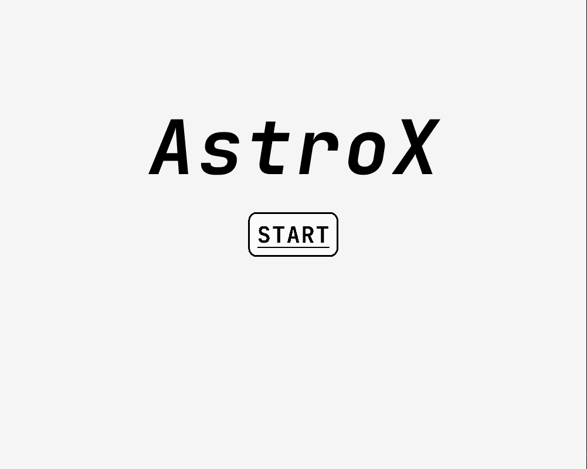
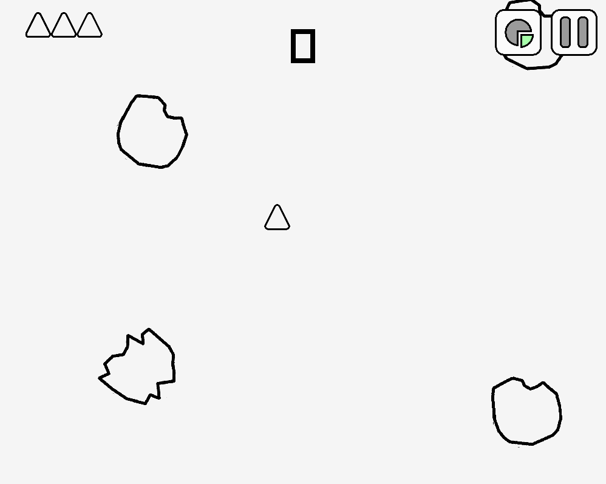
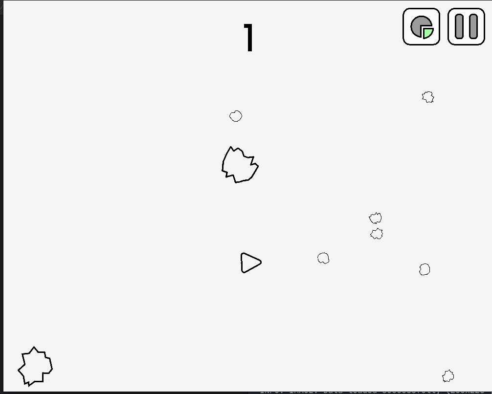
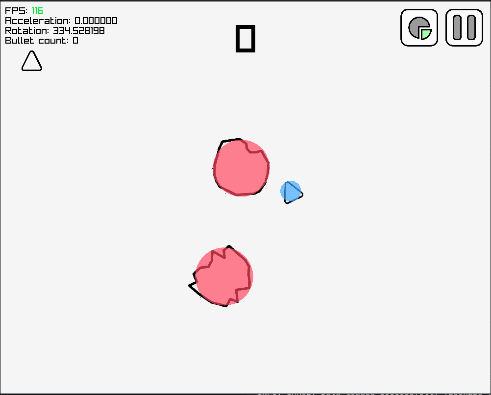
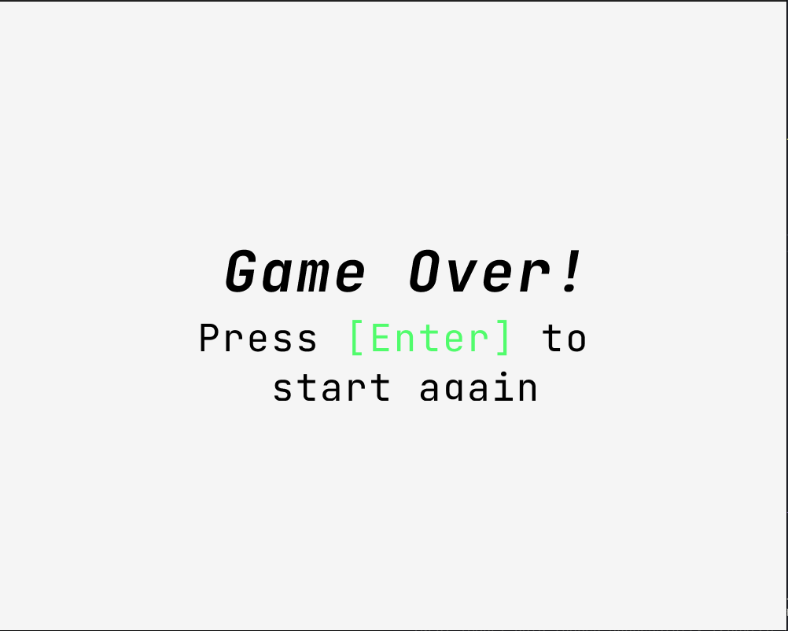

# AstroX [WIP]

> Work in progress Asteroids game made with [C++](https://en.wikipedia.org/wiki/C%2B%2B) and [Raylib](https://www.raylib.com/).

## Screenshots
---
**Start Screen**

**In Game**

**Debug**

**Game Over**

## Controls

#### ***Movement:***

**W** | **Up Arrow** - Forward \
**A** | **Left Arrow** - Left \
**S** | **Down Arrow** - Backward \
**D** | **Right Arrow** - Right

#### ***Shooting:***

**Space** - Shoot